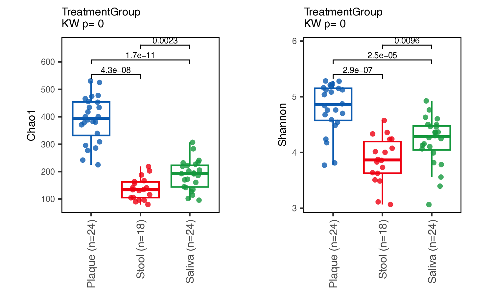

# General-microbiome-analysis (GoTools) # processing

## Description
This repository contains a set of tools for reproducible microbiome analysis. It includes scripts for various purposes, such as data visualization, statistical testing, data transformation, and more.

## Installation

`Gotools` was built on R 4.2.2.

To install the Bioconductor packages required by Gotools, use the following function:

```r
# Function to install and load Bioconductor packages
install_load_bioc <- function(package) {
  if (!require(package, character.only = TRUE, quietly = TRUE)) {
    if (!requireNamespace("BiocManager", quietly = TRUE)) {
      install.packages("BiocManager")
    }
    BiocManager::install(package, force = TRUE, ask = FALSE)
  }
  library(package, character.only = TRUE, quietly = TRUE)
}

# Installing and loading required Bioconductor packages
bioconductor_packages <- c("phyloseq", "microbiome", "Rhtslib", "dada2", "dplyr",
                           "ggpubr", "ggfortify", "genefilter", "ggpmisc", "S4Vectors",
                           "ShortRead", "illuminaio", "rstatix", "useful", "DECIPHER",
                           "ComplexHeatmap", "DESeq2", "ALDEx2", "scater", "ANCOMBC")

for (package in bioconductor_packages) {
  install_load_bioc(package)
}

```


To install the latest version of `Gotools` from GitHub, use:

```r
# install.packages("devtools")
devtools::install_github("bbagy/Gotools")
library(Gotools)

# Installing and loading CRAN packages
Gotool_dependency()
```

---


## Gotools Tutorial

This tutorial provides step-by-step instructions on using the Gotools package for microbiome data analysis with R. It includes reading data, preprocessing, and running various analyses.

### Reading R Source and the data

```r
# Clean the environment
rm(list=ls())

# Load Gotools package
library("Gotools")

# Install and load dependencies using Gotools function
Gotool_dependency()


# Define project name and directories
project <- "Gotool_test"
currentwd <- "~/your_path/"
setwd(currentwd)

# Read ASV data and merge Phyloseq objects
ps <- readRDS("2_rds/your_ps.rds")

# Generate empty mapping file 
Go_emptyMap(ps,project) # The file generate in `project_today_data/3_map`


# Read and apply sample metadata
sampledata <- read.csv("3_map/your.mapping.csv", row.names=1, check.names=FALSE)
ps1 <- merge_phyloseq(ps, sample_data(sampledata))
```

### Preprocessing

```r
# Check and filter sequence lengths
Go_SeqLengths(ps1) # Original distribution

ps1.size <- Go_SeqLengths(psIN=ps1, from=297, to=470) # Filtered
ps2 <- Go_filter(ps1.size,cutoff = 0.000005)
map <- data.frame(sample_data(ps2))

# Define order for plots
unique(map$TreatmentGroup)
orders <- c("Plaque", "Stool", "Saliva")

# Define colors for plots
basel <- Go_myCols(piratepal = "basel")
```


### Bar Plots for Taxonomic Composition
```r
Go_barchart(psIN=ps2, project=project, cutoff=0.005, taxanames=c("Phylum","Class","Order","Family","Genus","Species"), cate.vars="TreatmentGroup", mycols=basel, orders=orders)
```

### Alpha Diversity Analysis
```r
adiv <- Go_adiv(psIN=ps2, project=project, alpha_metrics=c("Chao1", "Shannon"))
basel <- Go_myCols(piratepal="basel")

# Boxplot for alpha diversity metrics
Go_boxplot(df=adiv, project=project, mycols=basel, cate.vars=c("TreatmentGroup"), outcomes=c("Chao1", "Shannon"), orders=orders)
```





### Beta Diversity Analysis
```r
# Betadiveristy for PCoA plot
ps2_log <- transform_sample_counts(ps2, function(x) log(1+x))
Go_bdiv(psIN=ps2_log, project=project, cate.vars=c("TreatmentGroup"), distance_metrics=c("bray"), orders=basel)
```


```r
# Permanova analysis
Go_perm(psIN = ps2, cate.vars = c("TreatmentGroup"), project =project, distance_metrics =c("bray"), 
        mul.vars = F, name = NULL)

Go_pairedperm(psIN=ps2, cate.vars = c("TreatmentGroup"), project =project, distance_metrics=c("bray"), 
              cate.conf=NULL, des=NULL, name=NULL)
```


### Differential Abundance Testing
```r
# Using Deseq2
Go_Deseq2(ps2, project, cate.outs="TreatmentGroup", orders=orders)

# Using Aldex2
Go_Aldex2(ps2, project, cate.outs="TreatmentGroup", orders=orders)

# Using Ancom2
Go_Ancom2(ps2, project, cate.outs="TreatmentGroup", orders=orders)

### Volcano Plots for Differential Abundance
mycol <- Go_myCols(piratepal="southpark")

# Deseq2 Volcano Plot
path <- file.path(sprintf("%s_%s/table/Deseq2/", project, format(Sys.Date(), "%y%m%d")))
Go_volcanoPlot(project, file_path=path, files=".csv", mycols=mycol)

# Aldex2 Volcano Plot
path <- file.path(sprintf("%s_%s/table/Aldex2/", project, format(Sys.Date(), "%y%m%d")))
Go_volcanoPlot(project, file_path=path, files=".csv", mycols=mycol)

# Ancom2 Volcano Plot
path <- file.path(sprintf("%s_%s/table/Ancom2/", project, format(Sys.Date(), "%y%m%d")))
Go_volcanoPlot(project, file_path=path, files=".csv", mycols=mycol)

```

---

## List of Tools
The repository includes the following scripts:

- **Go_DA_heatmap.R**: A script used to create heatmaps, a graphical representation of data where values are depicted as colors, for differential abundance (DA) analysis.
- **Go_DA_plot.R**: A script for creating plots to visualize differential abundance analysis results.
- **Go_adiv.R**: A script for alpha diversity computations. Alpha diversity is a measure of diversity within a particular area or ecosystem.
- **Go_alluvialplot.R**: A script for generating alluvial plots, which are a type of flow diagram to represent changes in network structure over time.
- **Go_ancom_plot.R**: A script for creating plots for ANCOM (Analysis of Composition of Microbiomes), a method to determine features that are differentially abundant (or present) between different groups.
- **Go_barchart.R**: A script to generate bar charts.
- **Go_bdiv.R**: A script for computing and visualizing beta diversity. Beta diversity is a comparison of diversity between ecosystems, usually measured as the change in amount of species.
- **Go_biplot_function.R**: A script to create biplots, a type of graph used in statistics to display information from a multivariate dataset.
- **Go_boxplot.R**: A script for generating box plots, a type of graph used to display the distribution of data.
- **Go_cleanMito.R**: A script to clean or filter out mitochondrial sequences from a dataset.
- **Go_correlation.R**: A script to compute and visualize correlations between different variables or features.
- **Go_deseq2fishtaco.R**: ---
- **Go_dist.R**: A script to compute or visualize distance metrics, often used in beta-diversity analysis.
- **Go_filter.R**: A script to filter datasets.
- **Go_function2ps.R**: A script to convert functional profiles (e.g., from metagenomic or metatranscriptomic data) to a phyloseq object, a container for storing and analyzing phylogenetic sequencing data in R.
- **Go_krakenLog.R**: A script to processing or analyzing Kraken output. Kraken is a system for assigning taxonomic labels to short DNA sequences.
- **Go_linear.R**: A script for conducting linear regression analysis.
- **Go_lmem.R**: A script to perform linear mixed-effects model analysis.
- **Go_perm.R**: A script for running permutation tests.
- **Go_pheatmap.R**: A script to generate heatmaps, specifically using the pheatmap function in R which offers more control over heatmap generation.
- **Go_psTotab.R**: A script to convert a phyloseq object to a table for further processing or analysis.
- **Go_regression.R**: A script for performing regression analysis.
- **Go_rf_function_sets.R**: A script for performing random forest analysis, a machine learning technique.

## Usage # processing
The scripts in this repository are written in R. To use these tools, clone the repository and run the scripts using an R environment. Each script is self-contained and can be run independently unless specified otherwise.

## Contributions
---

---

