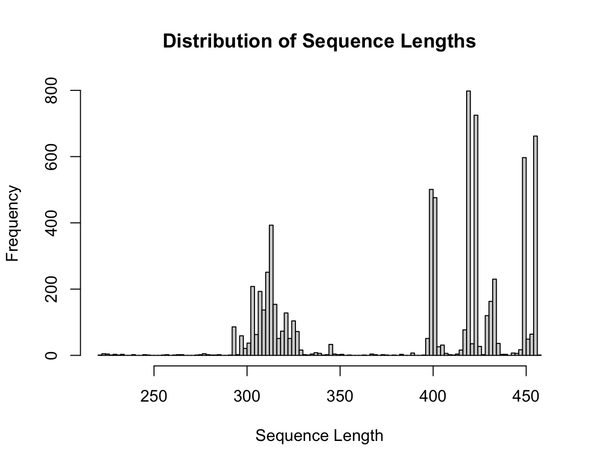
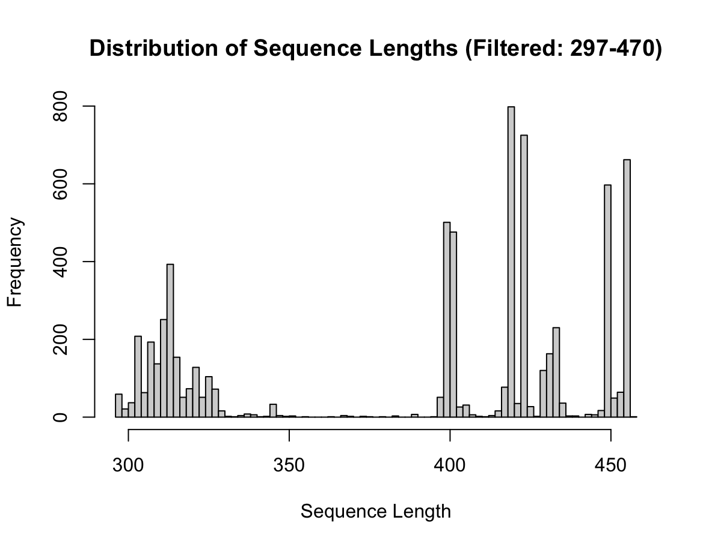

# Gotools

## Description
This repository contains a set of tools for reproducible microbiome analysis. It includes scripts for various purposes, such as data visualization, statistical testing, data transformation, and more.

## Purpose & Design Philosophy

> Gotools guarantees the floor of analysis quality, consistency, and
> reproducibility. Workflow layers built on top of it extend the ceiling
> of analytical depth.

Gotools standardizes the analyses that should remain consistent across
projects. Project-specific decisions and additional analyses belong in an
upper workflow layer and should extend, not replace, the standard results.
Every analysis should preserve three outputs together: a runnable script, an
environment/input/parameter record, and the rendered HTML report.

## Installation

`Gotools` requires R >= 4.1.

For a fresh install, use this order:

```r
# install.packages("devtools")
devtools::install_github("bbagy/Gotools", force = TRUE)
library(Gotools)
Gotool_dependency()
```

This order matters.

- `devtools::install_github()` installs the package itself
- `library(Gotools)` makes `Gotool_dependency()` available
- `Gotool_dependency()` then installs or repairs the broader CRAN/Bioconductor stack used by `Gotools`

`Gotool_dependency()` is the main dependency entrypoint for `Gotools`. It checks
required CRAN and Bioconductor packages, installs missing packages, and repairs
packages that are installed but not loadable.

This includes common microbiome dependencies such as `phyloseq`,
`microbiome`, `DESeq2`, `ALDEx2`, and `ANCOMBC`.

If you update `Gotools` later, the clean refresh path is the same:

```r
devtools::install_github("bbagy/Gotools", force = TRUE)
library(Gotools)
Gotool_dependency()
```

If installation fails, the most common cause is a missing system tool rather
than an R package issue. In particular:

- `ANCOMBC` may require `CVXR`, `clarabel`, and the Rust toolchain (`cargo`)
- some transitive installs may require `terra`
- macOS systems may also need `libomp`

If needed, install Rust in Terminal:

```bash
curl --proto '=https' --tlsv1.2 -sSf https://sh.rustup.rs | sh
```

If needed on macOS, install OpenMP support:

```bash
brew install libomp
```

Then restart R and run `Gotool_dependency()` again.

---

## Gotools Tutorial

This tutorial provides step-by-step instructions on using the Gotools package for microbiome data analysis with R. It includes reading data, preprocessing, and running various analyses.

### Reading R Source and the data

```r
# Clean the environment
rm(list=ls())

# Load Gotools package
library("Gotools")

# Install and load dependencies using Gotools function
Gotool_dependency()

# Define project name and directories
project <- "Gotool_test"
currentwd <- "~/your_path/"
setwd(currentwd)

# raw_asv_file is DADA2 output (Go_tabTops()-ready): ASV sequences as row
# names, Kingdom-Genus taxonomy from a classifier (SILVA, etc.), and per-
# sample counts. Species is frequently unresolved at this stage (e.g.
# "Genus NA") because short amplicon reads often can't distinguish closely
# related species on their own.
raw_asv_file <- "1_out/your_project.psTotab.asvTable.csv"

# Go_blastASVs() BLASTs each ASV sequence against a reference 16S database
# (defaults to the one bundled with Gotools) and uses the hit as a
# BLAST-supported candidate to fill in Species only where the classifier
# left it unresolved AND the BLAST genus already agrees with the
# classifier's genus - it's reference-guided annotation for gaps, not an
# override of a taxonomy call the classifier already made confidently.
final_asv_file <- find_latest_final_asv(project)
if (is.na(final_asv_file) || !file.exists(final_asv_file)) {
  Go_blastASVs(project = project, asvsTable = raw_asv_file)
  final_asv_file <- find_latest_final_asv(project)
}

ps <- Go_tabTops(csv = final_asv_file, project = project)

# Generate empty mapping file
Go_emptyMap(ps,project) # The file generate in `project_today_data/3_map`

# Read and apply sample metadata
sampledata <- read.csv("3_map/your.mapping.csv", row.names=1, check.names=FALSE)
ps1 <- merge_phyloseq(ps, sample_data(sampledata))
```

`Go_tabTops()` returns a plain phyloseq object (no tree). If you have a
`tree.nwk` from the same DADA2 run, merge it in too:
`ps1 <- merge_phyloseq(ps, sample_data(sampledata), phy_tree(ape::read.tree("1_out/TREE/tree.nwk")))`.

Differential abundance later in the pipeline uses `Go_ConDaDist()`, which
ships in a **separate companion package**, `ConDAdist`
(`devtools::install_github("bbagy/ConDAdist")`) — not part of Gotools
itself. See [`inst/quickstart/`](inst/quickstart/) for where it's called.

### Preprocessing

```r
# Check and filter sequence lengths
Go_SeqLengths(ps1) # Original distribution
```
<p align="center">
  
</p>

```r
ps1.size <- Go_SeqLengths(psIN=ps1, from=297, to=470) # Filtered
```
<p align="center">
  
</p>

```r
ps2 <- Go_filter(ps1.size,cutoff = 0.000005)
map <- data.frame(sample_data(ps2))

# Define order for plots
unique(map$TreatmentGroup)
orders <- c("Plaque", "Stool", "Saliva")

# Define colors for plots
basel <- Go_myCols(piratepal = "basel")
```

`ps2` is now a filtered, ready-to-analyze phyloseq object. For composition
plots, diversity, and differential abundance from here, see
[`inst/quickstart/`](inst/quickstart/) for a runnable end-to-end example, or
copy a [`Download_templates/`](Download_templates/) script and swap in `ps2`
for its own data-import step. See "List of Tools" below for what each
analysis function does.

---

## Summary Report Generation

`Go_renderReport()` renders a single-file HTML summary report (16S, MG, or
RNAseq) from the objects built by `Go_expInfo()`, `Go_dirInfo()`,
`Go_tabInfo()`, `Go_imgInfo()`, and `Go_sumInfo()`. The report template and
lab logo are bundled with the package, so no external paths are needed.

```r
expInfo <- Go_expInfo(...)
dirInfo <- Go_dirInfo(...)
tabInfo <- Go_tabInfo(...)
imgInfo <- Go_imgInfo(...)
sumInfo <- Go_sumInfo(...)

Go_renderReport(
  family = "16S", # "16S", "MG", or "RNAseq"
  project = project,
  expInfo = expInfo, dirInfo = dirInfo, tabInfo = tabInfo,
  imgInfo = imgInfo, sumInfo = sumInfo,
  output_dir = "3_Summary_report"
)
```

Each `Go_*Info()` function prints its own option guide when called with no
arguments (e.g. `Go_expInfo()` alone lists kit/prep/spikein numbers).

Ready-to-copy skeleton scripts for each report family are in
[`Download_templates/`](Download_templates/):
`16S_Report_Template.R`, `MG_Report_Template.R`, `RNAseq_Report_Template.R`.

### Try it now with bundled demo data

Want to see a real rendered report before wiring up your own data? After
installing (no extra download needed — the demo data and quickstart scripts
ship inside the package):

```r
source(system.file("quickstart", "Quickstart_16S.R", package = "Gotools"))
# or Quickstart_MG.R / Quickstart_RNAseq.R
```

Each one runs the full pipeline (filtering, composition, diversity,
differential abundance, report rendering) against a small demo dataset
bundled with the package, writing the result under a per-OS user cache
directory (`tools::R_user_dir("Gotools", which = "cache")` — works the same
on macOS/Linux/Windows without guessing where `~` points). The 16S demo uses
real public NCBI 16S reference sequences (not patient data) with synthetic
counts and groups, so `Go_blastASVs()` produces genuine BLAST hits; the MG
and RNAseq demos are fully synthetic. Prefer to copy one and edit it
directly instead of installing? They're at
[`inst/quickstart/`](inst/quickstart/) in the repo.

## List of Tools
A curated subset of the ~90 exported functions (see `NAMESPACE` for the full
list). Each entry names the function and the file it currently lives in,
since several have been renamed or moved to new file versions over time.

- **`Go_adiv()`** (`Go_adiv_V2.R`): Alpha diversity computation.
- **`Go_alluvialplot()`** (`Go_alluvialplot_V2.R`): Alluvial/flow diagrams.
- **`Go_barchart()`** (`Go_barchart_v35.R`): Taxonomic composition bar charts.
- **`Go_bdivPM()`** (`Go_bdiv_V36.R`): Beta diversity ordination (PCoA) plus PERMANOVA in one call. Supersedes the old `Go_bdiv()`, which no longer exists.
- **`Go_biplot()`** (`Go_biplot_function_V2.R`): Biplots for multivariate data. Renamed from `Go_biplot_function()`.
- **`Go_boxplot()`** (`Go_boxplot_V10.R`): Box plots, e.g. for alpha diversity metrics.
- **`Go_correlation()`** (`Go_correlation_V3.R`): Correlations between variables/features.
- **`Go_DA_heat()`** (`Go_DA_heatmap_v1.R`): Differential abundance heatmaps. Renamed from `Go_DA_heatmap()`.
- **`Go_dist()`** (`Go_dist_V4.R`): Distance metric computation/visualization.
- **`Go_filter()`** (`Go_filter.R`): Low-abundance taxa filtering.
- **`Go_function2ps()`** (`Go_function2ps_V2.R`): Converts PICRUSt2/HUMAnN functional profiles to a phyloseq object.
- **`Go_kraken2Tops()`** (`Go_kraken2Tops.R`): Parses Kraken2/Bracken MPA output into a phyloseq object. Renamed from `Go_krakenLog()`.
- **`Go_linear()`** (`Go_linear_V4.R`): Linear regression analysis.
- **`Go_perm()`** (`Go_perm_V16.R`): Standalone PERMANOVA (see `Go_bdivPM()` for the plotting pipeline that already includes it).
- **`Go_pheatmap()`** (`Go_pheatmap_V2.R`): ComplexHeatmap-based heatmaps.
- **`Go_psTotab()`** (`Go_psTotab.R`): Converts a phyloseq object to a table.
- **`Go_regression()`** (`Go_regression_V34.R`): Regression analysis.
- **`Go_renderReport()`** (`Go_renderReport.R`): Renders the bundled 16S/MG/RNAseq HTML summary report from `Go_*Info()` objects. See "Summary Report Generation" above.
- **`Go_volcanoPlot()`** (`Go_volcanoPlot_v1.R`): Volcano plots from `Go_ConDaDist()` (or legacy DA function) results.
