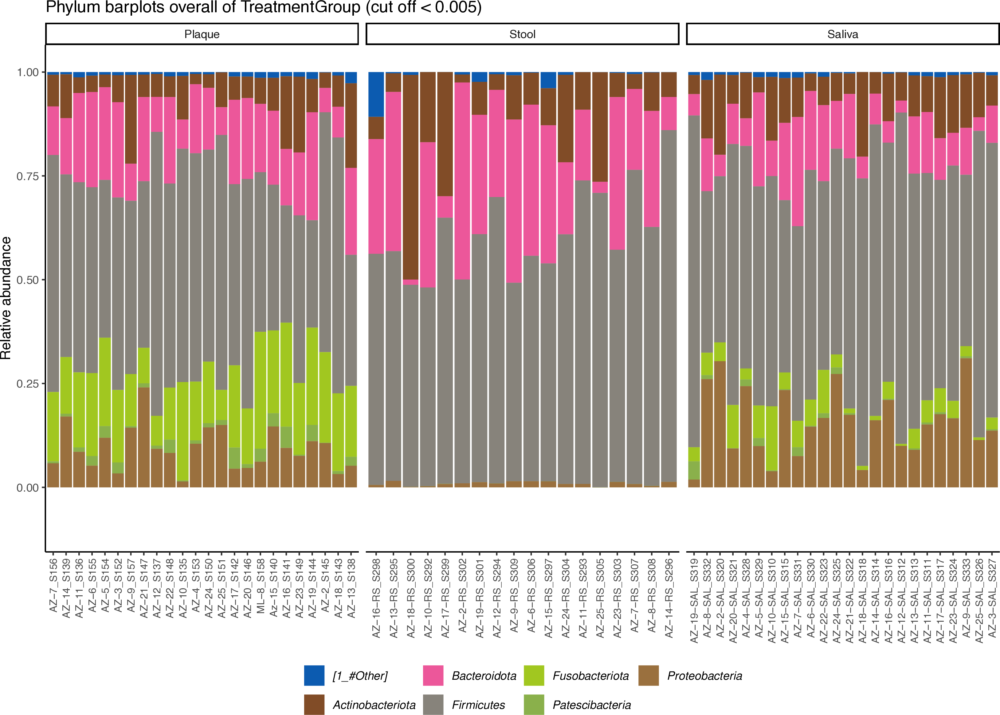
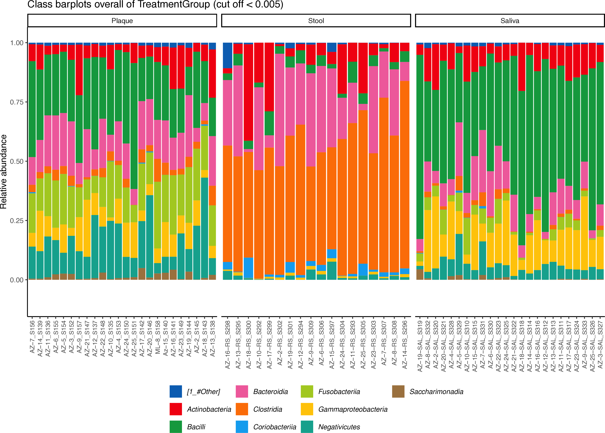
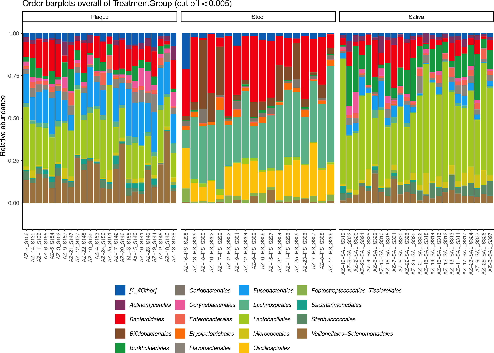
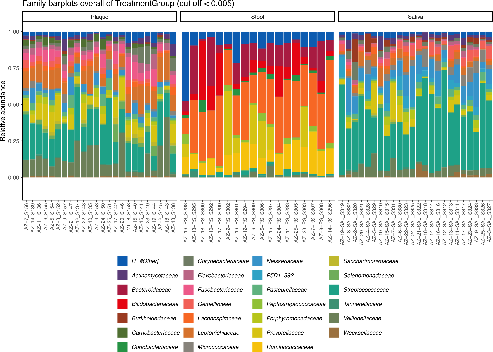
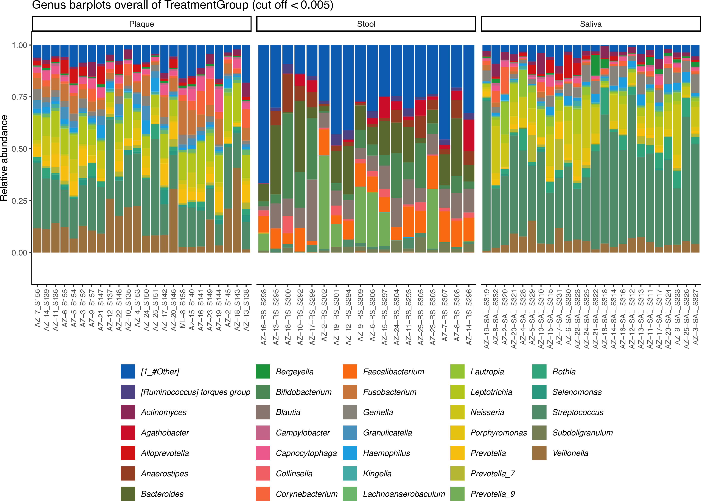
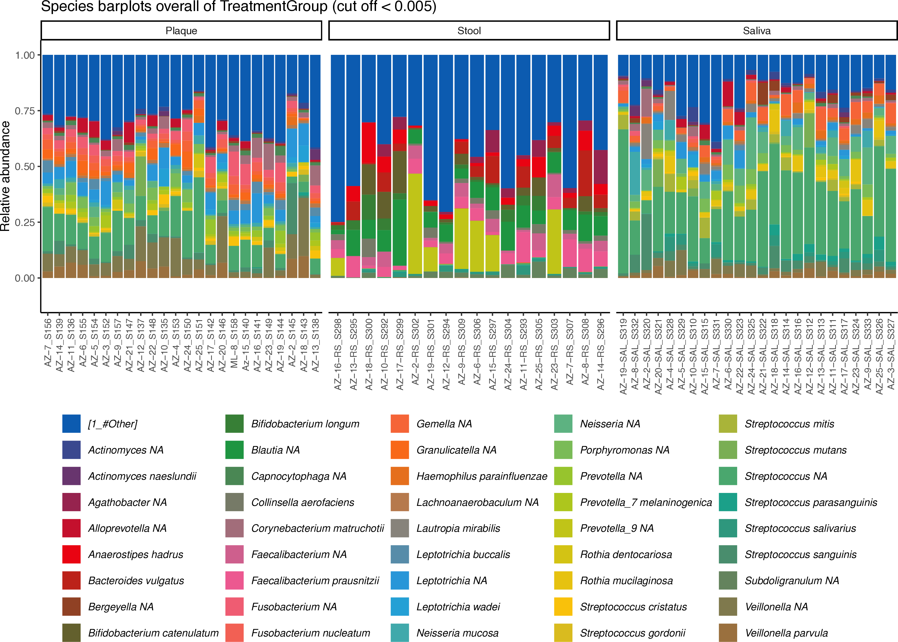
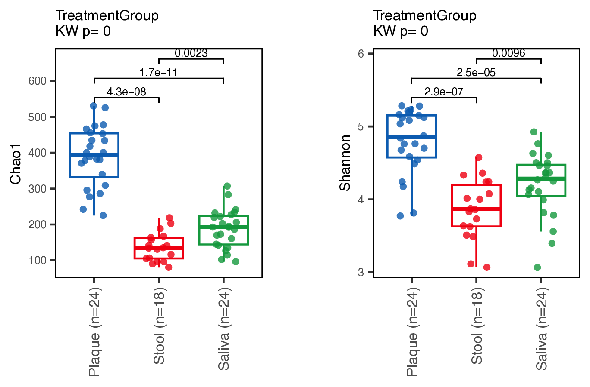
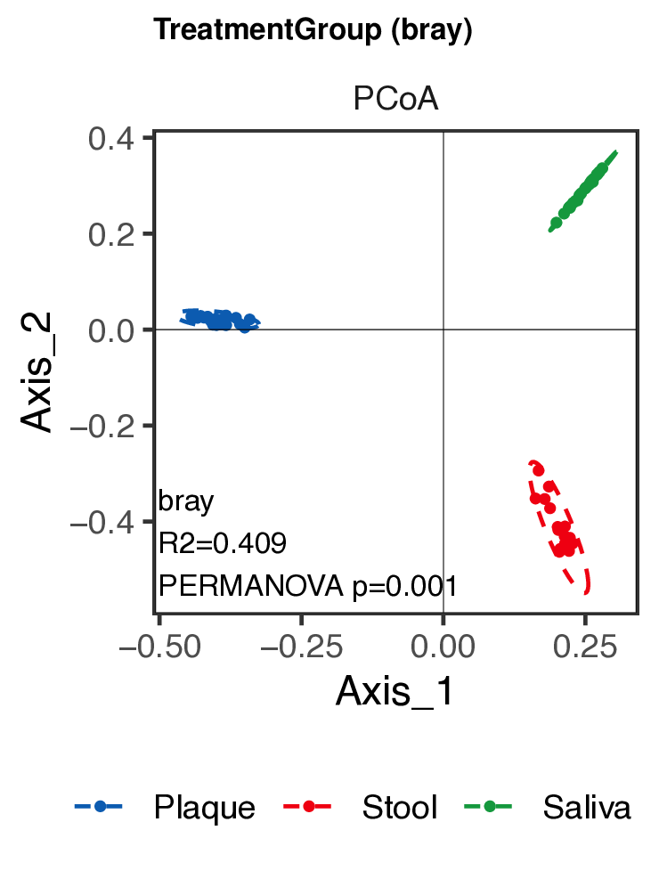
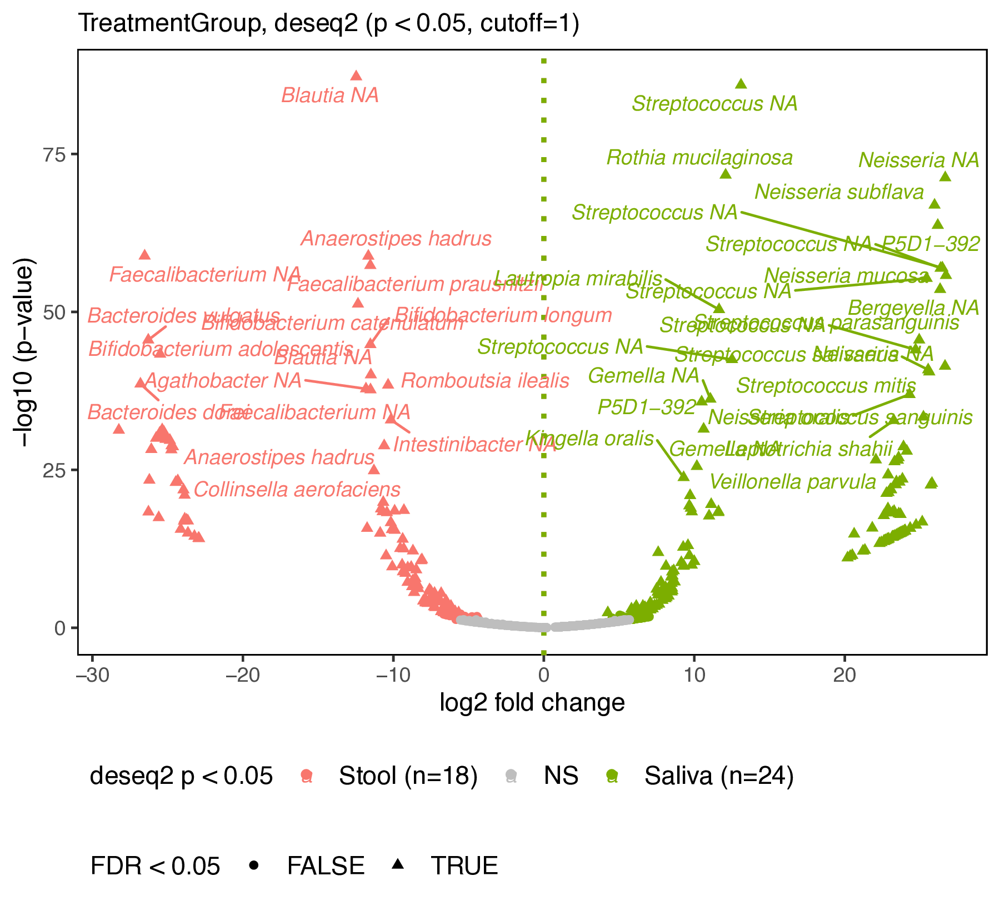

# General-microbiome-analysis (GoTools)

## Description
This repository contains a set of tools for reproducible microbiome analysis. It includes scripts for various purposes, such as data visualization, statistical testing, data transformation, and more.

## Purpose & Design Philosophy

> Gotools guarantees the floor of analysis quality, consistency, and
> reproducibility. Workflow layers built on top of it extend the ceiling
> of analytical depth.

Gotools standardizes the analyses that should remain consistent across
projects. Project-specific decisions and additional analyses belong in an
upper workflow layer and should extend, not replace, the standard results.
Every analysis should preserve three outputs together: a runnable script, an
environment/input/parameter record, and the rendered HTML report.

## Installation

`Gotools` was built on R 4.2.2.

For a fresh install, use this order:

```r
# install.packages("devtools")
devtools::install_github("bbagy/Gotools", force = TRUE)
library(Gotools)
Gotool_dependency()
```

This order matters.

- `devtools::install_github()` installs the package itself
- `library(Gotools)` makes `Gotool_dependency()` available
- `Gotool_dependency()` then installs or repairs the broader CRAN/Bioconductor stack used by `Gotools`

`Gotool_dependency()` is the main dependency entrypoint for `Gotools`. It checks
required CRAN and Bioconductor packages, installs missing packages, and repairs
packages that are installed but not loadable.

This includes common microbiome dependencies such as `phyloseq`,
`microbiome`, `DESeq2`, `ALDEx2`, and `ANCOMBC`.

If you update `Gotools` later, the clean refresh path is the same:

```r
devtools::install_github("bbagy/Gotools", force = TRUE)
library(Gotools)
Gotool_dependency()
```

If installation fails, the most common cause is a missing system tool rather
than an R package issue. In particular:

- `ANCOMBC` may require `CVXR`, `clarabel`, and the Rust toolchain (`cargo`)
- some transitive installs may require `terra`
- macOS systems may also need `libomp`

If needed, install Rust in Terminal:

```bash
curl --proto '=https' --tlsv1.2 -sSf https://sh.rustup.rs | sh
```

If needed on macOS, install OpenMP support:

```bash
brew install libomp
```

Then restart R and run `Gotool_dependency()` again.

---


## Gotools Tutorial

This tutorial provides step-by-step instructions on using the Gotools package for microbiome data analysis with R. It includes reading data, preprocessing, and running various analyses.

### Reading R Source and the data

```r
# Clean the environment
rm(list=ls())

# Load Gotools package
library("Gotools")

# Install and load dependencies using Gotools function
Gotool_dependency()


# Define project name and directories
project <- "Gotool_test"
currentwd <- "~/your_path/"
setwd(currentwd)

# Read ASV data and merge Phyloseq objects
ps <- readRDS("2_rds/your_ps.rds")

# Generate empty mapping file 
Go_emptyMap(ps,project) # The file generate in `project_today_data/3_map`


# Read and apply sample metadata
sampledata <- read.csv("3_map/your.mapping.csv", row.names=1, check.names=FALSE)
ps1 <- merge_phyloseq(ps, sample_data(sampledata))
```

### Preprocessing

```r
# Check and filter sequence lengths
Go_SeqLengths(ps1) # Original distribution
```
#### 
<p align="center">
  
</p>

```r
ps1.size <- Go_SeqLengths(psIN=ps1, from=297, to=470) # Filtered
```
#### 
<p align="center">
  
</p>


```r
ps2 <- Go_filter(ps1.size,cutoff = 0.000005)
map <- data.frame(sample_data(ps2))

# Define order for plots
unique(map$TreatmentGroup)
orders <- c("Plaque", "Stool", "Saliva")

# Define colors for plots
basel <- Go_myCols(piratepal = "basel")
```


### Bar Plots for Taxonomic Composition
```r
Go_barchart(psIN=ps2, project=project, cutoff=0.005, taxanames=c("Phylum","Class","Order","Family","Genus","Species"), cate.vars="TreatmentGroup", mycols=basel, orders=orders, height=4, width=8)
```
#### Phylum
<p align="center">
  
</p>

#### Class
<p align="center">
  
</p>

#### Order
<p align="center">
  
</p>

#### Family
<p align="center">
  
</p>

#### Genus
<p align="center">
  
</p>

#### Species
<p align="center">
  
</p>


### Alpha Diversity Analysis
```r
adiv <- Go_adiv(psIN=ps2, project=project, alpha_metrics=c("Chao1", "Shannon"))
basel <- Go_myCols(piratepal="basel")

# Boxplot for alpha diversity metrics
Go_boxplot(df=adiv, project=project, mycols=basel, cate.vars=c("TreatmentGroup"), outcomes=c("Chao1", "Shannon"), orders=orders)
```


<p align="center">
  
</p>


### Beta Diversity Analysis
```r
# PCoA ordination plot + PERMANOVA (statistics=TRUE, the default) in one call
Go_bdivPM(psIN=ps2, cate.vars="TreatmentGroup", project=project, orders=orders,
          distance_metrics=c("bray"), mycols=basel, height=4.5, width=7, plotCols=1, plotRows=1)
```
<p align="center">
  
</p>

For paired/repeated-measures designs, pass the subject ID column as `strata_var` to block
PERMANOVA permutations by subject; for a lower-level standalone PERMANOVA outside the
plotting pipeline, see `Go_perm()`/`Go_pairedperm()`.


### Differential Abundance Testing

`Go_Deseq2()`, `Go_Aldex2()`, and `Go_Ancom2()` are retained under `legacy/`
only for reproducibility of historical analyses. They are not part of the
current Gotools public API and should not be used in new analysis scripts.
`Go_ConDaDist()` (from the companion `ConDAdist` package) is the current
entry point — it runs ancombc2/aldex2/deseq2 (and more) as a consensus DA
call and returns an output directory `Go_volcanoPlot()` reads directly:

```r
# devtools::install_github("bbagy/ConDAdist")
library(ConDAdist)

da_result_dir <- NULL
for (method in c("ancombc2", "aldex2", "deseq2")) {
  da_result_dir <- Go_ConDaDist(psIN=ps2, project=project, group_var="TreatmentGroup",
                                 group_1=orders[1], group_2=orders[2],
                                 covariates=NULL, methods=method, distances=NULL, name=NULL)
}
# Go_ConDaDist() returns the same project/date output directory regardless of
# method, so call Go_volcanoPlot() once after the loop - it scans that
# directory for every method's result CSV in one pass.
Go_volcanoPlot(project=project, result=da_result_dir, fc=0, mycols=NULL, font=3, height=5, width=6)
```

<p align="center">
  
</p>

---

## Summary Report Generation

`Go_renderReport()` renders a single-file HTML summary report (16S, MG, or
RNAseq) from the objects built by `Go_expInfo()`, `Go_dirInfo()`,
`Go_tabInfo()`, `Go_imgInfo()`, and `Go_sumInfo()`. The report template and
lab logo are bundled with the package, so no external paths are needed.

```r
expInfo <- Go_expInfo(...)
dirInfo <- Go_dirInfo(...)
tabInfo <- Go_tabInfo(...)
imgInfo <- Go_imgInfo(...)
sumInfo <- Go_sumInfo(...)

Go_renderReport(
  family = "16S", # "16S", "MG", or "RNAseq"
  project = project,
  expInfo = expInfo, dirInfo = dirInfo, tabInfo = tabInfo,
  imgInfo = imgInfo, sumInfo = sumInfo,
  output_dir = "3_Summary_report"
)
```

Each `Go_*Info()` function prints its own option guide when called with no
arguments (e.g. `Go_expInfo()` alone lists kit/prep/spikein numbers).

Ready-to-copy skeleton scripts for each report family are in
[`Download_templates/`](Download_templates/):
`16S_Report_Template.R`, `MG_Report_Template.R`, `RNAseq_Report_Template.R`.

### Try it now with bundled demo data

Want to see a real rendered report before wiring up your own data? After
installing (no extra download needed — the demo data and quickstart scripts
ship inside the package):

```r
source(system.file("quickstart", "Quickstart_16S.R", package = "Gotools"))
# or Quickstart_MG.R / Quickstart_RNAseq.R
```

Each one runs the full pipeline (filtering, composition, diversity,
differential abundance, report rendering) against a small demo dataset
bundled with the package, writing the result under a per-OS user cache
directory (`tools::R_user_dir("Gotools", which = "cache")` — works the same
on macOS/Linux/Windows without guessing where `~` points). The 16S demo uses
real public NCBI 16S reference sequences (not patient data) with synthetic
counts and groups, so `Go_blastASVs()` produces genuine BLAST hits; the MG
and RNAseq demos are fully synthetic. Prefer to copy one and edit it
directly instead of installing? They're at
[`inst/quickstart/`](inst/quickstart/) in the repo.

## List of Tools
The repository includes the following scripts:

- **Go_DA_heatmap.R**: A script used to create heatmaps, a graphical representation of data where values are depicted as colors, for differential abundance (DA) analysis.
- **Go_DA_plot.R**: A script for creating plots to visualize differential abundance analysis results.
- **Go_adiv.R**: A script for alpha diversity computations. Alpha diversity is a measure of diversity within a particular area or ecosystem.
- **Go_alluvialplot.R**: A script for generating alluvial plots, which are a type of flow diagram to represent changes in network structure over time.
- **Go_ancom_plot.R**: A script for creating plots for ANCOM (Analysis of Composition of Microbiomes), a method to determine features that are differentially abundant (or present) between different groups.
- **Go_barchart.R**: A script to generate bar charts.
- **Go_bdiv.R**: A script for computing and visualizing beta diversity. Beta diversity is a comparison of diversity between ecosystems, usually measured as the change in amount of species.
- **Go_biplot_function.R**: A script to create biplots, a type of graph used in statistics to display information from a multivariate dataset.
- **Go_boxplot.R**: A script for generating box plots, a type of graph used to display the distribution of data.
- **Go_cleanMito.R**: A script to clean or filter out mitochondrial sequences from a dataset.
- **Go_correlation.R**: A script to compute and visualize correlations between different variables or features.
- **Go_deseq2fishtaco.R**: ---
- **Go_dist.R**: A script to compute or visualize distance metrics, often used in beta-diversity analysis.
- **Go_filter.R**: A script to filter datasets.
- **Go_function2ps.R**: A script to convert functional profiles (e.g., from metagenomic or metatranscriptomic data) to a phyloseq object, a container for storing and analyzing phylogenetic sequencing data in R.
- **Go_krakenLog.R**: A script to processing or analyzing Kraken output. Kraken is a system for assigning taxonomic labels to short DNA sequences.
- **Go_linear.R**: A script for conducting linear regression analysis.
- **Go_lmem.R**: A script to perform linear mixed-effects model analysis.
- **Go_perm.R**: A script for running permutation tests.
- **Go_pheatmap.R**: A script to generate heatmaps, specifically using the pheatmap function in R which offers more control over heatmap generation.
- **Go_psTotab.R**: A script to convert a phyloseq object to a table for further processing or analysis.
- **Go_regression.R**: A script for performing regression analysis.
- **Go_renderReport.R**: Renders the bundled 16S/MG/RNAseq HTML summary report from `Go_*Info()` objects. See "Summary Report Generation" above.
- **Go_rf_function_sets.R**: A script for performing random forest analysis, a machine learning technique.

## Usage
The scripts in this repository are written in R. To use these tools, clone the repository and run the scripts using an R environment. Each script is self-contained and can be run independently unless specified otherwise.

## Contributions
---

---
